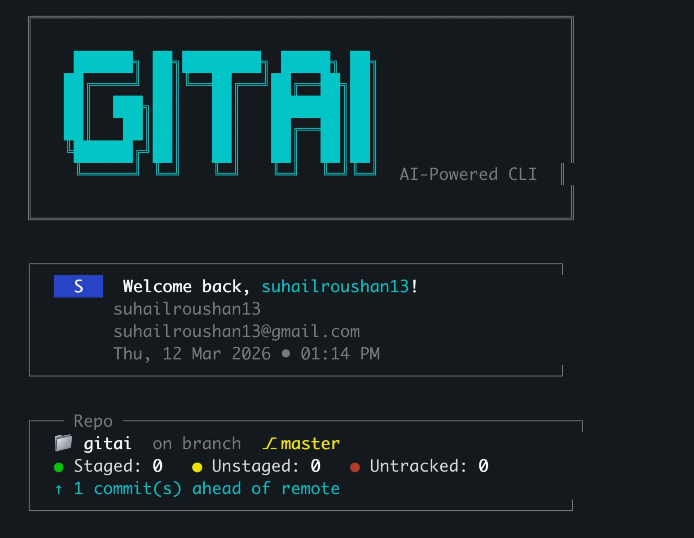
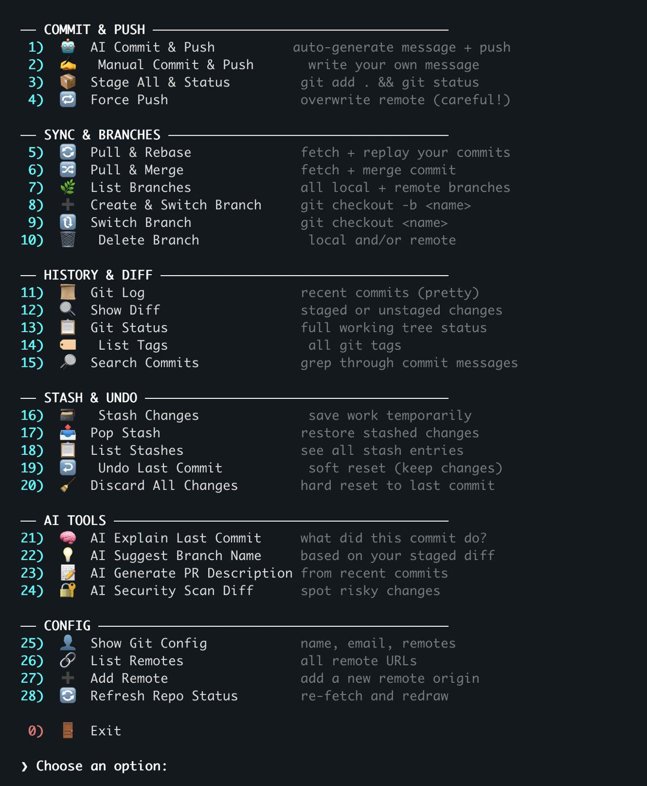
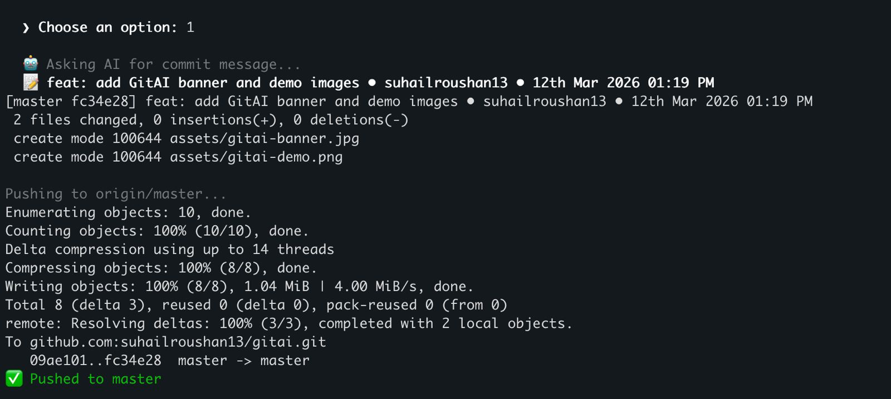
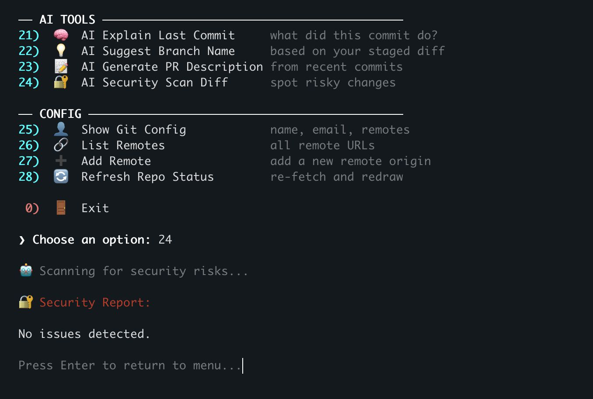
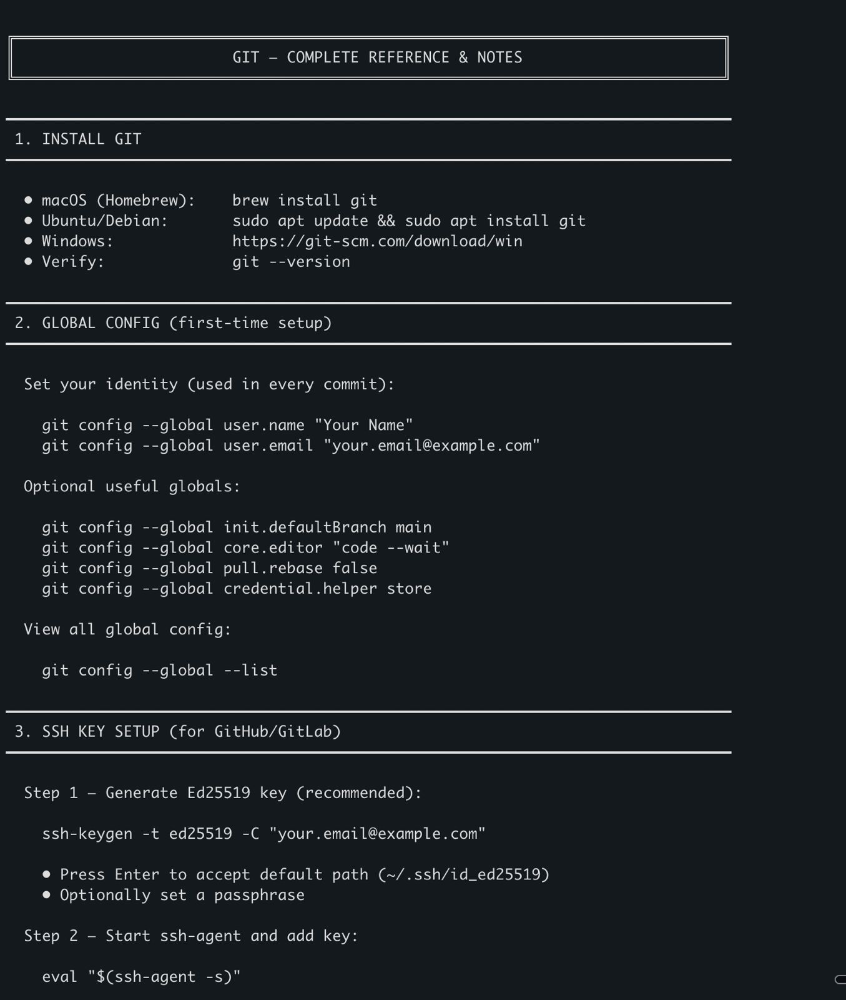

<div align="center">



<br/>
<br/>

# gitai

### AI-Powered Git CLI

**Commit, push, branch, stash, undo and more — with AI-generated commit messages, PR descriptions, security scans, and a built-in Git reference.**

[](https://www.npmjs.com/package/@suhailroushan/gitai)
[](LICENSE)
[](https://github.com/suhailroushan13/gitai)

<br/>

[Installation](#-installation) •
[Uninstall](#uninstall) •
[Setup](#-setup) •
[Usage](#-usage) •
[Features](#-features) •
[Docs](#-built-in-docs) •
[Contributing](#-contributing) •
[License](#-license)

<br/>



</div>

<br/>

---

<br/>

## 📦 Installation

### Prerequisites

Make sure you have these installed:

| Tool | Check | Install |
|------|-------|---------|
| **Git** | `git --version` | [git-scm.com](https://git-scm.com) |
| **Node.js** (>=16) | `node -v` | [nodejs.org](https://nodejs.org) |
| **jq** | `jq --version` | `brew install jq` / `sudo apt install jq` |
| **curl** | `curl --version` | Pre-installed on most systems |

<br/>

### Install with npm

```bash
npm install -g @suhailroushan/gitai
```

### Install with pnpm

```bash
pnpm add -g @suhailroushan/gitai
```

### Install with yarn

```bash
yarn global add @suhailroushan/gitai
```

### Install from source

```bash
git clone https://github.com/suhailroushan13/gitai.git
cd gitai
npm install -g .
```

<br/>

### Uninstall

To remove GitAI from your system, use the **same package manager** you used to install:

```bash
# npm (default with nvm; binary often in ~/.nvm/versions/node/*/bin/)
npm uninstall -g @suhailroushan/gitai

# pnpm
pnpm remove -g @suhailroushan/gitai

# yarn
yarn global remove @suhailroushan/gitai
```

If you're not sure which one is active, run `which gitai` — if the path contains `nvm`, use **npm**; if it contains `pnpm`, use **pnpm**. If you installed with more than one manager, run the matching uninstall for each.

If you installed from source with `npm install -g .`, run `npm uninstall -g @suhailroushan/gitai` from any directory.

<br/>

### Verify installation

```bash
gitai --help
```

You should see:

```
  gitai — AI-powered Git CLI
  Usage: gitai [option]

  Options:
    --docs, -d, docs   Show full Git reference (setup, SSH, commands)
    --help, -h         Show this help

  With no options, starts the interactive menu.
```

<br/>

---

<br/>

## 🔧 Setup

### 1. Get a DeepSeek API Key

GitAI uses [DeepSeek AI](https://platform.deepseek.com/) to generate commit messages, PR descriptions, and more.

1. Go to [platform.deepseek.com](https://platform.deepseek.com/)
2. Sign up or log in
3. Navigate to **API Keys** and create a new key
4. Copy the key (starts with `sk-`)

<br/>

### 2. Add the API Key to your shell

**For zsh** (default on macOS):

```bash
echo 'export DEEPSEEK_API_KEY="sk-your-key-here"' >> ~/.zshrc
source ~/.zshrc
```

**For bash:**

```bash
echo 'export DEEPSEEK_API_KEY="sk-your-key-here"' >> ~/.bashrc
source ~/.bashrc
```

**Verify it's set:**

```bash
echo $DEEPSEEK_API_KEY
```

<br/>

### 3. Configure Git (if not already done)

```bash
git config --global user.name "Your Name"
git config --global user.email "your.email@example.com"
git config --global init.defaultBranch main
```

<br/>

### 4. Set up SSH Keys (recommended)

SSH keys let you push/pull without entering your password every time.

**Generate a new Ed25519 key:**

```bash
ssh-keygen -t ed25519 -C "your.email@example.com"
```

- Press **Enter** to accept the default path (`~/.ssh/id_ed25519`)
- Optionally set a passphrase

**Start the SSH agent and add your key:**

```bash
eval "$(ssh-agent -s)"
ssh-add ~/.ssh/id_ed25519
```

**Copy the public key:**

```bash
# macOS
pbcopy < ~/.ssh/id_ed25519.pub

# Linux
cat ~/.ssh/id_ed25519.pub
```

**Add to GitHub:**

1. Go to **GitHub** → **Settings** → **SSH and GPG keys**
2. Click **New SSH key**
3. Paste your key, give it a title, and click **Add SSH key**

**Test the connection:**

```bash
ssh -T git@github.com
```

You should see: *"Hi username! You've successfully authenticated..."*

<br/>

---

<br/>

## 🚀 Usage

### Start the interactive menu

```bash
gitai
```

<br/>

### Quick commands

| Command | Description |
|---------|-------------|
| `gitai` | Launch interactive menu |
| `gitai --docs` | Show full Git reference & notes |
| `gitai docs` | Same as above |
| `gitai -d` | Same as above |
| `gitai --help` | Show help |
| `gitai -h` | Same as above |

<br/>

### First commit workflow

```bash
# Create a project
mkdir my-project && cd my-project
git init

# Write some code...

# Launch gitai
gitai

# Choose option 1 → AI Commit & Push
# GitAI will:
#   1. Stage all changes (git add .)
#   2. Generate an AI commit message from your diff
#   3. Commit with the message
#   4. Push to origin
```

<br/>

---

<br/>

## ✨ Features

### 29 commands organized into 7 categories:

<br/>

### 🚀 Commit & Push

| # | Command | Description |
|---|---------|-------------|
| 1 | **AI Commit & Push** | Auto-generate a semantic commit message using AI and push |
| 2 | **Manual Commit & Push** | Write your own message, commit, and push |
| 3 | **Stage All & Status** | `git add .` + `git status` |
| 4 | **Force Push** | Overwrite remote (with confirmation) |

<br/>

### 🔄 Sync & Branches

| # | Command | Description |
|---|---------|-------------|
| 5 | **Pull & Rebase** | Fetch + replay your commits on top |
| 6 | **Pull & Merge** | Fetch + merge commit |
| 7 | **List Branches** | All local + remote branches |
| 8 | **Create & Switch Branch** | `git checkout -b <name>` |
| 9 | **Switch Branch** | `git checkout <name>` |
| 10 | **Delete Branch** | Local and/or remote (prevents deleting current branch) |

<br/>

### 📜 History & Diff

| # | Command | Description |
|---|---------|-------------|
| 11 | **Git Log** | Pretty graph of recent 25 commits |
| 12 | **Show Diff** | Staged, unstaged, or vs last commit |
| 13 | **Git Status** | Full working tree status |
| 14 | **List Tags** | All tags (newest first) |
| 15 | **Search Commits** | Grep through commit messages |

<br/>

### 📦 Stash & Undo

| # | Command | Description |
|---|---------|-------------|
| 16 | **Stash Changes** | Save work temporarily |
| 17 | **Pop Stash** | Restore stashed changes |
| 18 | **List Stashes** | See all stash entries |
| 19 | **Undo Last Commit** | Soft reset (keeps changes staged) |
| 20 | **Discard All Changes** | Hard reset to last commit (with confirmation) |

<br/>

### 🤖 AI Tools

| # | Command | Description |
|---|---------|-------------|
| 21 | **AI Explain Last Commit** | Plain-English summary of what changed |
| 22 | **AI Suggest Branch Name** | Generate a branch name from your diff |
| 23 | **AI Generate PR Description** | Full PR write-up from recent commits |
| 24 | **AI Security Scan Diff** | Spot hardcoded secrets, API keys, and vulnerabilities |

<br/>

### ⚙️ Config

| # | Command | Description |
|---|---------|-------------|
| 25 | **Show Git Config** | Name, email, editor, remotes |
| 26 | **List Remotes** | All remote URLs |
| 27 | **Add Remote** | Add a new remote |
| 28 | **Refresh** | Re-fetch and redraw screen |

<br/>

### 📖 Docs

| # | Command | Description |
|---|---------|-------------|
| 29 | **Git Docs** | Full Git reference with examples (also via `gitai --docs`) |

<br/>

---

<br/>

## 📖 Built-in Docs

GitAI ships with a comprehensive built-in Git reference. Access it anytime:

```bash
gitai --docs
```

The docs cover:

| Section | Topics |
|---------|--------|
| **Install Git** | macOS, Ubuntu/Debian, Windows |
| **Global Config** | `user.name`, `user.email`, `init.defaultBranch`, `core.editor`, aliases |
| **SSH Key Setup** | `ssh-keygen`, `ssh-agent`, adding key to GitHub, testing |
| **First Repo** | `git init` → first commit → add remote → push |
| **Clone** | HTTPS and SSH |
| **Daily Workflow** | status, diff, add, commit, push, pull, branches, undo, stash, log, remotes, tags |
| **Config Options** | `pull.rebase`, `push.autoSetupRemote`, `fetch.prune`, aliases |
| **Conventional Commits** | feat, fix, docs, style, refactor, test, chore |

<br/>

---

<br/>

## 🖥️ Screenshots

<div align="center">

### AI Commit & Push


<br/><br/>

### AI Security Scan


<br/><br/>

### Built-in Docs


</div>

<br/>

---

<br/>

## 🗂️ Project Structure

```
gitai/
├── bin/
│   └── gitai.sh          # Main CLI script
├── assets/
│   ├── gitai-banner.jpg
│   ├── gitai-demo.png
│   ├── gitai-ai-commit.png
│   ├── gitai-docs.png
│   └── gitai-security-scan.png
├── package.json
├── LICENSE
└── README.md
```

<br/>

---

<br/>

## 🤝 Contributing

Contributions are welcome!

```bash
# Fork and clone
git clone https://github.com/<your-username>/gitai.git
cd gitai

# Make it executable
chmod +x bin/gitai.sh

# Link it globally for testing
npm link

# Make your changes...

# Test locally
gitai

# Create a PR
```

<br/>

---

<br/>

## 📝 License

[MIT](LICENSE) — Made with ❤️ by [Suhail Roushan](https://github.com/suhailroushan13)

<br/>

---

<div align="center">

**[Star this repo](https://github.com/suhailroushan13/gitai)** if you find it useful!

<br/>

<a href="https://github.com/suhailroushan13/gitai">
  
</a>

</div>
